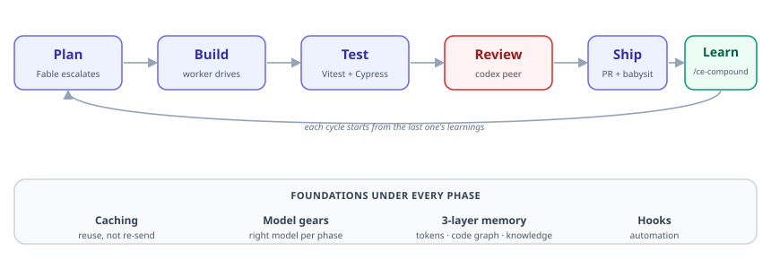

# Overdrive: get more out of every token

*A harness that assembles the right set of tools so your coding agent does more with the tokens you already have. Higher gear — not a bigger budget.*

---

You hit the weekly limit mid-feature, and it stings. Scroll back to see where it went, and it wasn't the feature — it was overhead: re-pasting the context the agent forgot, a search that dumped forty files into the window you were thinking in, your most expensive model talked through the same plan twice.

**The limits aren't the problem. What you do inside them is.** Most setups run in first gear — one heavy model doing everything, the project re-explained every session, tool output dumped into the main window, Monday's bug rediscovered on Thursday. Overdrive is the same engine in a higher gear: a cheap worker model does the typing, your project stays **cached** instead of re-sent, **subagents** run the messy searches and hand back just the answer, a **second model** reviews the diff, and every fix gets **written down** so you never learn it twice. Same budget — more of it spent on the feature.

It's a harness: the right tools, assembled, one `git clone` and one command away.

> **The 20-second version**
>
> - **What:** a starter repo that assembles the right tools around your coding agent — a worker / reasoning / review **model split**, a **cached project contract**, a **code-graph memory**, **live docs**, **isolated subagents**, and a **growing log of solved problems**.
> - **Why:** your tokens go to outcomes, not overhead — the SDLC you already run (plan, build, test, review, ship, learn), accelerated, not skipped.
> - **How:** `git clone git@github.com:kevinold/overdrive.git && bash scripts/bootstrap.sh`
> - **The moat:** every fix gets written down, so the next session starts from the answer.

One caveat, because someone will raise it: caching *amortizes* the cost across a session — it doesn't erase it. The first turn of a fresh session pays more, not less: bigger harness, bigger warm-up. The win is every turn after. This is for people who actually work a session, not type one line and leave.

Here's the whole machine on one page:



<sub>*Prefer to poke at it? An [interactive version](overdrive-sdlc.html) — pan, zoom, theme-switch, export PNG — lives alongside this post.*</sub>

The rest of this post walks that diagram. Read it top to bottom or skip to the phase you care about.

## What's actually in the harness

The harness is a stack of layers, each doing one job. Here's every layer worth naming — what it is, and why it earns its place. Bottom-up: the foundations that make each turn cheaper, the gears that decide which model does what, the phase tools that turn the SDLC from a tax into an accelerant, and the glue that ties them together.

### The foundation: make every turn cheaper

**The cached contract — `AGENTS.md` (and `CLAUDE.md`).** Your conventions, your project's shape, the rules you always want followed — none of it changes turn to turn, so a stable file at the repo root states it once and the model reads it from cache instead of you re-explaining. It's the difference between an agent that forgets your project every morning and one that shows up already knowing it.

**`codebase-memory-mcp` — a queryable map of your code.** A local code graph of the whole repo, with every symbol, call, and reference indexed. Instead of reading ten files into its context to answer "what calls this function?", the agent *asks the graph* and gets the answer in a line. Navigation replaces re-reading — which is where a large share of a working session's tokens quietly go.

**`context7` — current docs, on tap.** It pulls real, version-correct documentation for a library at the moment the agent needs it. That's the layer that kills the classic failure where the model confidently writes against an API that changed two versions ago. Looked up, not hallucinated.

**Three memories, three horizons.** Those last two aren't the same thing, and neither is the third, so it's worth seeing them as one layered memory. The prompt cache holds *this session's tokens*. `codebase-memory-mcp` holds *your code's shape*. `docs/solutions/` plus file-memory hold *durable knowledge* across sessions. Different caches, different lifespans, one rule: don't pay twice for the same thing.

**Hooks — the automation you'd forget.** Small scripts the harness runs on your behalf: re-index the code graph when a session starts; fire a gate the moment a plan lands without a spec check. This is also what makes "not vibe-coding" more than a slogan — a hook actually *fires*, so the discipline doesn't depend on you remembering it.

### The glue: compound-engineering

Most of what follows — the model gears, the phase commands, `/ce-compound` — comes from **compound-engineering**, the plugin that ties the loose tools into one workflow. On its own you'd have a drawer of sharp tools; compound-engineering is what turns them into a harness. It hands you the model-gear config, the `ce-plan → ce-work → ce-code-review` flow (or `lfg` to run the lot end to end), and the compounding loop. Everything below is a layer it either provides or wires together. (The full inventory — every plugin and MCP server with its exact install line — is in [`docs/harness-inventory.md`](../docs/harness-inventory.md).)

### The gears: which model does what

Running one model for everything is the single biggest source of wasted budget, and the easiest thing to fix. The harness runs three gears, set in [`.compound-engineering/config.yaml`](../.compound-engineering/config.yaml):

```yaml
plan_model: fable
brainstorm_model: fable
cross_model_peer: codex
```

**Driver — the worker.** Opus or Sonnet, set per session, does the typing and the building. It's the gear you spend most of the day in, so it should be capable, not maximal.

**Overdrive — reasoning.** A reasoning-tuned model (Fable) escalates for the few steps where thinking actually pays: authoring a plan, generating approaches. You don't burn the reasoning budget renaming variables; you spend it on the two or three moments per feature where a better plan saves an hour of building.

**Peer — cross-model review.** This is the layer people skip, and it's the one that catches what the others can't. `cross_model_peer: codex` hands the finished work to a *different model, trained by a different company*, to review it adversarially. Not the same model grading its own homework — a genuine second opinion from a system with different blind spots. It has caught production-write bugs the primary model was too close to see. Two honest notes: it runs on a **separate subscription** (codex isn't free and isn't part of your Claude budget — it buys a second opinion, not more tokens), and it **sends your code to a third party** (full file contents leave your Claude provider for OpenAI). Turn it on as a reviewed, opt-in choice weighed against how sensitive your repo is; leave `cross_model_peer` unset if your code can't leave. The repo's [`AGENTS.md`](../AGENTS.md) says so at the top, on purpose.

### The phases: the SDLC as an accelerant

Every tool above lands on a phase of the lifecycle you already run. The harness doesn't let you skip a phase — it makes running one cheaper than skipping it.

**Plan.** `ce-plan` sends the reasoning-heavy planning to Fable; `ce-brainstorm` opens the problem up first; `ce-doc-review` runs a panel of reviewers — and the cross-model peer — over the plan *before* you build. The thinking happens on the right model, and gets reviewed, before a line is written.

**Build.** `ce-work` and `lfg` drive on the worker model. The quiet workhorse here is **subagent and fork isolation**: a wide "where is this used" search runs inside a subagent that reads forty files and hands back three lines — the other thirty-seven never touch your main window. That isolation is the single biggest lever on getting more done per token, because the context you're thinking in stays uncluttered.

**Test.** The harness ships a testing *discipline*, not just a runner: Vitest and Cypress in a dual-layer TDD contract (a behavior change updates both), plus `agent-browser` and `ui-visual-validator` for what a unit test can't see. Tests come first; validation runs on every change.

**Review.** The cross-model peer leads, then `ce-code-review`. Two more lenses are baked into how the agent itself behaves: **ponytail** gives it a lazy-senior-developer instinct — the best code is the code you don't write — so it stops gold-plating and reaches for the smallest thing that works; **caveman** strips its prose down to signal, so its output doesn't clog the context you're paying to keep clear. Quality and terseness as defaults, not reminders.

**Ship.** `ce-commit-push-pr` writes the PR; `ce-babysit-pr` watches CI to green and nudges it along.

**Learn.** `/ce-compound` writes each non-trivial fix — the bug, the fix, what didn't work — into `docs/solutions/`, and the next session reads it. This is the layer that makes the whole thing compound.

## One real session

Here's what a task looks like end to end, so the gears stop being abstract.

A ticket comes in. The **worker** (Opus, driving) reads it and the relevant code — via the code graph, not by dumping files into the window. The problem is gnarly enough to plan, so it **escalates to Fable**, which writes the plan while the worker waits. A wide "where is this used across the repo" search goes to a **subagent**, which reads forty files and hands back three lines; the other thirty-seven never touch the main window. The worker builds against the plan, writes the tests first, and when the diff is ready it goes to the **codex peer**, which flags an edge case the primary model was too close to see. Fixed. Then `/ce-compound` writes the whole thing — the bug, the fix, what didn't work — into `docs/solutions/`, so the next time this shape of problem shows up, the session opens with the answer already in hand.

Count the gears: your reasoning model ran once, to plan; the peer ran once, on its own subscription; the cheap worker did everything else. The messy search never polluted the context, and the lesson got banked. On your Claude budget, those are the tokens you'd have spent anyway — pointed at the work instead of the warm-up.

## Get it: clone and one command

The whole harness is a starter repo. Clone it, run one command:

```bash
git clone git@github.com:kevinold/overdrive.git && cd overdrive
bash scripts/bootstrap.sh              # lean core: compound-engineering + the two MCP servers + gears + validation
bash scripts/bootstrap.sh --with-extras   # adds the opt-in plugins
bash scripts/bootstrap.sh --dry-run    # prints every action, changes nothing
```

The default install is deliberately lean — enough to feel the difference on the first task, not a 30-minute setup you abandon halfway. The full kit is one flag away. And the lean core — the part that actually stretches your tokens — runs entirely on the Claude subscription you already have; the codex peer is an optional add-on you opt into, not a second bill you need before any of this pays off.

One boundary, so you're not surprised: **overdrive is a Claude Code harness that ports its conventions to any agent — not a full harness for every agent.** The `AGENTS.md` contract and the two MCP servers (`context7`, `codebase-memory-mcp`) work anywhere that reads `AGENTS.md` and speaks MCP — Codex, Cursor, Gemini, OpenCode all get that. The plugin, skill, and hook acceleration is Claude-Code-specific. Don't clone it expecting Cursor to run `ce-plan`; do clone it expecting every agent to share the same context contract and memory layer.

Before you run it on anything that matters: skim [`docs/harness-inventory.md`](../docs/harness-inventory.md) and [`docs/install.md`](../docs/install.md), and review the marketplace list. You're installing third-party plugins that can run commands in your agent's environment. Trust, then verify.

## The part that compounds

Everything above makes a single session more effective. The reason to actually adopt it is what happens across sessions.

Every non-trivial fix gets written to `docs/solutions/`. File-memory carries what matters between sessions. The code graph stays current. So the harness doesn't just run efficiently today — it gets *more* effective the longer you use it, because it stops rediscovering things it already knew. That's the moat: a machine that learns and keeps what it learns.

The limits never moved. You just stopped idling in first gear.

*Clone it: [`github.com/kevinold/overdrive`](https://github.com/kevinold/overdrive). Kick the tires with `--dry-run` first.*
