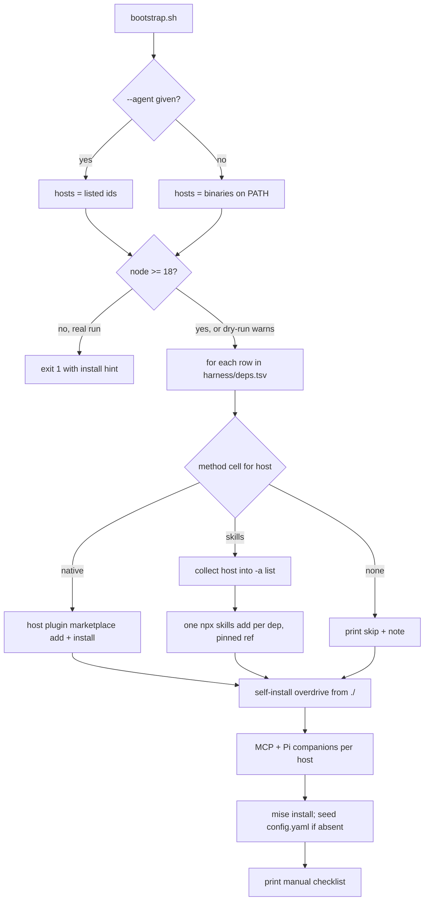
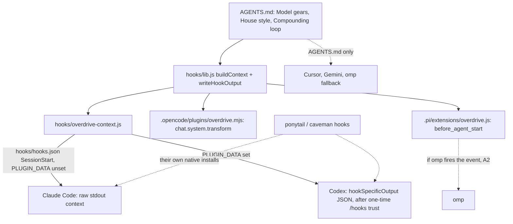

# Cross-Agent Harness - Plan

**Target repo:** overdrive

## Goal Capsule

- **Objective:** A developer running Codex, OpenCode, Pi, or oh-my-pi (omp) gets the overdrive harness — its skills, house-style hooks, MCP servers, and model-gear guidance — from one `bootstrap.sh` run, the same way a Claude Code user does today, and every host's actual support level is stated in one matrix instead of a "Claude-only" disclaimer.
- **Means:** Restructure overdrive the way compound-engineering ships — one agent-neutral source tree plus thin per-host manifests (KTD1) — drive `bootstrap.sh` from a dependency catalog (KTD2, KTD3), and ship one portable hook with per-host adapters (KTD4).
- **Authority:** this plan > overdrive `AGENTS.md` house style (ponytail: least code, reuse, question existence) > the compound-engineering and ponytail reference implementations named under Patterns. Where a host's live CLI contradicts a command this plan specifies, the CLI wins; record the deviation in the PR body.
- **Stop conditions:** `npx skills add owner/repo#<sha>` refuses commit-pinned refs (Key Decision KD2 depends on it) — stop and report. A host binary present locally (claude, codex, pi) rejects the manifest or install command the plan specifies with no `--dry-run`-safe alternative — stop and report. Hosts absent locally (opencode, omp) are never a stop: they are dry-run and unit-test verified only (Assumptions A1–A3).
- **Execution profile:** hands-off (`lfg` → `ce-work` → PR against `main`). The executor finishes and ships; real-run installs of the 18 dependencies into the developer's global host configs are not required for done — dry-run output plus tests are the gate (Verification Contract). Overdrive's own self-install smoke on locally present Pi and Codex is required; the 18-dependency real run is not.

---

## Product Contract

### Summary

Overdrive becomes an installable multi-host plugin and a cross-agent installer. The repo gains `skills/`, `agents/`, and `hooks/` as the agent-neutral source, plus the per-host manifests Claude Code, Codex, OpenCode, Pi, and omp each read natively. `scripts/bootstrap.sh` detects installed hosts (or takes `--agent`), reads `harness/deps.tsv`, and installs each of the 18 dependencies by that host's native plugin path when one exists, by `npx skills` pinned to a commit when only skills are portable, or prints a documented skip. One Node hook script injects the gears and compounding-loop reminder on every host with a hook surface; hosts without one fall back to `AGENTS.md`. A per-host capability matrix replaces the "Claude-Code-specific" boundary in every doc except the blog.

### Problem Frame

Feedback from readers: overdrive is too Claude-Code-specific. Today `bootstrap.sh` prints `/plugin` lines to paste into Claude Code, registers two MCP servers with Codex, and stops; README, AGENTS.md, `docs/install.md`, GEMINI.md, and the Cursor rule all repeat that plugins, skills, and hooks are Claude-only. The prior plan's decision D1 (AGENTS.md + MCP port only) is superseded here on purpose. Meanwhile compound-engineering already ships native manifests for all five target hosts, ponytail ships one Node hook that adapts to Claude, Codex, Pi, and OpenCode at runtime, and `npx skills` installs any repo's skills into per-host skill directories — so the portable form exists, and overdrive only has to adopt it.

### Requirements

**Plugin layout and self-install**

- R1. Overdrive's own content lives once in agent-neutral directories (`skills/`, `agents/`, `hooks/`); per-host manifests reference them and carry no content of their own.
- R2. Overdrive installs natively on Claude Code, Codex, OpenCode, Pi, and omp from a local clone, with a schema-less root manifest.
- R3. `ui-visual-validator` is a skill usable from any host; on Claude Code it remains invocable as a subagent through a thin wrapper that defers to the skill.

**Installer**

- R4. `bootstrap.sh` targets the hosts named by `--agent <id>[,<id>]` (ids `claude-code`, `codex`, `opencode`, `pi`, `omp`) or, when the flag is absent, every host whose binary is on `PATH`; no host on `PATH` and no flag is an error.
- R5. For each dependency and selected host, the installer takes the method recorded in `harness/deps.tsv` — `native`, `skills`, or `none` — and never guesses.
- R6. `skills`-method installs run through `npx skills` against a commit-pinned ref recorded in the catalog, into the host's global skill directory.
- R7. MCP servers (`context7`, `codebase-memory-mcp`) are wired per host by that host's native config path; Pi additionally gets its `pi-mcp-adapter` and `pi-subagents` companions.
- R8. `mise install` and the `.compound-engineering/config.yaml` seed-if-absent behavior are preserved.
- R9. `--dry-run` prints every action for the selected hosts and mutates nothing, and works on a machine where the selected host binaries are absent.
- R10. Steps a host cannot take from the shell (Codex hook trust, OpenCode `plugin` array edit, omp auto-update, restarts) are printed as an ordered manual checklist at the end of the run.
- R11. A real run requires `node` ≥ 18 on `PATH` and fails early with an install hint when it is missing; a dry run only warns.
- R12. Re-running the installer is safe: already-installed plugins and skills do not abort the run, and an existing `config.yaml` is never overwritten.

**Hooks**

- R13. One shared hook script builds the session context (model gears, house style, compounding loop) from `AGENTS.md` at runtime, so the injected text has one owner.
- R14. The context is injected on Claude Code and Codex (hooks JSON, SessionStart), OpenCode (plugin system-prompt transform), and Pi (extension `before_agent_start`).
- R15. Hosts without a usable hook surface (Cursor, Gemini, and omp until Assumption A2 is verified) receive the same content through `AGENTS.md` only, and the matrix says so.
- R16. House-style hooks (ponytail, caveman) arrive through those dependencies' own native installs; where a dependency has no hook for a host, the matrix records the gap rather than overdrive re-implementing it.

**Documentation**

- R17. The "Portability boundary" / "Claude-Code-specific" statements in README, AGENTS.md, `docs/install.md`, GEMINI.md, and `.cursor/rules/overdrive.mdc` are replaced by a per-host summary that links to `docs/capability-matrix.md`.
- R18. Each full-harness host's way of setting driver, reasoning, and peer models is documented with a reference snippet; no unifying gears config is introduced.
- R19. `harness/deps.tsv` is the single source for dependency × host install methods; docs link to it rather than duplicating its rows.

**Tests**

- R20. `node --test tests/` covers the hook output shapes, both host adapters, catalog validity, and the installer's dry-run output per host; `shellcheck scripts/bootstrap.sh` passes.
- R21. The overdrive version declared in `package.json` and every per-host manifest agrees, enforced by a test.

### Key Decisions

- KD1. **Full-harness targets are Claude Code, Codex, OpenCode, Pi, and omp; Cursor and Gemini/Antigravity stay at AGENTS.md + MCP** (session-settled: user-approved — chosen over full parity for every host: Cursor and Gemini have no plugin/hook surface worth adapting today). Governs R2, R4, R14, R15, R17.
- KD2. **Dependencies with no native non-Claude install get their skills installed pinned to a commit, not skipped** (session-settled: user-approved — chosen over skip-and-document: a pinned skill install is deterministic and keeps the harness useful off-Claude). Governs R5, R6.
- KD3. **The installer stays bash — extend `scripts/bootstrap.sh`** (session-settled: user-approved — chosen over a Node/Bun CLI like compound-engineering's converter: bash is cheaper to maintain and the installer never needs to rewrite skill files). Governs R4–R12.
- KD4. **Model gears are documented per host, not unified into one config** (session-settled: user-approved — chosen over one config driving all hosts: each host's model-selection surface differs in shape and a unifying layer would be a converter in disguise). Governs R18.
- KD5. **`npx skills` (vercel-labs/skills) installs skill packages** (session-settled: user-directed — chosen over hand-vendoring skill directories into a shared folder: it already writes every target host's skill dir and supports `#ref` pinning). Governs R6.

### Scope Boundaries

In scope: the layout, manifests, installer, hook and adapters, catalog, tests, and the docs named in R17–R19.

Outside this product's identity: a Bun/TypeScript converter; publishing overdrive to any host marketplace; a project-scope install mode.

#### Deferred to Follow-Up Work

- `blog/overdrive.md` still states the old boundary — update after this ships.
- Porting the wshobson packs' 30 agents and 5 commands, compound-writing's 18 agents, and the ralph Stop hooks to non-Claude hosts (no skill form exists; catalog rows say `none`).
- `typescript-lsp` off-Claude: it is a manifest for an npm binary; document `npm i -g typescript-language-server typescript` as a tool prerequisite later.
- A GitHub Actions workflow running `npm test` + `shellcheck` (overdrive has no CI today; tooling additions are the owner's call).
- SubagentStart injection for the overdrive hook (ponytail issue #252 pattern) — add when a subagent demonstrably needs the gears reminder.
- Registering `ui-visual-validator` as an OpenCode subagent via the plugin `config` hook — add when isolation on OpenCode is requested.
- Editing `opencode.json` with `jq` instead of printing the snippet — add once OpenCode is installed locally and the 1.x `plugin` vs 2.x `plugins` key can be detected.
- Caveman's richer OpenCode native install (`npx -y github:JuliusBrussee/caveman --only opencode`, hooks included) as an alternative to its skills-only row.
- User-scope MCP registration for Claude Code (`.mcp.json` stays project-scoped as today).
- An omp-specific hook adapter (tool_call `additionalContext` re-arm) if Assumption A2 proves false.

### Success Criteria

- `bash scripts/bootstrap.sh --dry-run --agent codex` on a machine without Codex prints every Codex action for all 18 dependencies plus MCP, companions, and the manual checklist — a reader can audit the whole install before trusting it.
- `grep -rn "Claude-Code-specific" README.md AGENTS.md docs GEMINI.md .cursor` returns nothing; the phrase survives only in `blog/`.
- A Codex or Pi user following `docs/install.md` reaches a working `ce-plan` skill invocation and sees "OVERDRIVE HARNESS ACTIVE" context at session start (Pi and Codex are verifiable locally).

### Acceptance Examples

- AE1. Detection without `--agent`
  - **Covers:** R4
  - **Given:** only `claude` and `pi` are on `PATH`
  - **When:** `bootstrap.sh --dry-run` runs
  - **Then:** output contains a `claude-code` section and a `pi` section and no `codex`, `opencode`, or `omp` actions.
- AE2. Dry run for an absent host
  - **Covers:** R9
  - **Given:** `omp` is not installed
  - **When:** `bootstrap.sh --dry-run --agent omp` runs
  - **Then:** every omp action prints prefixed `DRY-RUN:` and exit status is 0.
- AE3. Real run for an absent host
  - **Covers:** R4, R11
  - **Given:** `--agent codex,pi` and `codex` is not on `PATH`
  - **When:** `bootstrap.sh` runs without `--dry-run`
  - **Then:** pi actions execute, a `codex: binary not found, skipped` line prints, and the exit status is non-zero.
- AE4. `none` row
  - **Covers:** R5
  - **Given:** `debugging-toolkit` has `none` for `codex`
  - **When:** the codex host is selected
  - **Then:** one line `skip debugging-toolkit on codex: agents/commands only, no skill form` prints and no install command is emitted for it.
- AE5. Hook output shape
  - **Covers:** R13, R14
  - **Given:** `hooks/overdrive-context.js`
  - **When:** run with `PLUGIN_DATA` unset, then with `PLUGIN_DATA` set to a temp dir
  - **Then:** the first run writes raw text beginning `OVERDRIVE HARNESS ACTIVE`; the second writes one JSON object with `hookSpecificOutput.hookEventName` = `SessionStart` and the same text in `additionalContext`.
- AE6. Idempotent rerun
  - **Covers:** R8, R12
  - **Given:** `.compound-engineering/config.yaml` exists with edits
  - **When:** `bootstrap.sh` runs again
  - **Then:** the file is byte-identical afterwards and the run reports it left the gears untouched.

---

## Planning Contract

### Key Technical Decisions

- KTD1. **Adopt compound-engineering's root-native plugin layout, schema-less.** Content in `skills/`, `agents/`, `hooks/`; manifests at `.claude-plugin/{plugin,marketplace}.json`, `.codex-plugin/plugin.json` + `.agents/plugins/marketplace.json`, `.omp-plugin/marketplace.json` (plugin entry carries `version` so omp's update checker sees releases), `package.json#pi` (`extensions` + `skills`, the omp discovery gate) with `main` pointing at the OpenCode plugin (ponytail's shape, no root `index.js`), and `.opencode/plugins/overdrive.mjs`. No `$schema` on any manifest: it truncates Codex skills over 8000 bytes and pushes omp ≥ 17.3 onto its strict provider (compound-engineering posture 2026-08-17). `.claude/agents/ui-visual-validator.md` is deleted — the plugin-level `agents/` file replaces it and loads in every project once overdrive is installed. Cites KD1; governs R1, R2.
- KTD2. **`harness/deps.tsv` is the dependency catalog; bash reads it with `read -r` on tab-separated fields.** Columns: `dep`, `marketplace`, `source` (`owner/repo`), `ref` (40-hex commit for `skills` rows), `skills` (`*` or a space-separated list; bootstrap splits it into a bash array without glob expansion and passes the names as separate `-s` arguments — skills@1.7.0 does not split on commas), then one method column per host `claude-code`, `codex`, `opencode`, `pi`, `omp` (`native` | `skills` | `none`), and `note`. Precedence when filling a cell: native when the dependency ships that host's manifest, else `skills` when it has skill files, else `none`. GitHub renders TSV as a table, so no generated docs table and no drift test — docs link to the file (R19). Initial rows are the table under High-Level Technical Design; refs come from the marketplace clones already on the developer's machine (`git rev-parse HEAD` in `<claude-config-dir>/plugins/marketplaces/<marketplace>/`), which pins off-Claude installs to the same commit Claude Code runs. Cites KD2.
- KTD3. **Per-host install commands** (session-settled: user-directed via KD5 for the `skills` column — chosen over hand-vendoring: npx skills already writes each host's skill dir; cites KD2, KD3; governs R5–R7):

| Host | Native plugin install (dep or overdrive itself) | `skills` method | MCP |
|---|---|---|---|
| claude-code | `claude plugin marketplace add <owner/repo>` once per marketplace, then `claude plugin install <dep>@<marketplace>` (user scope default). Self: `marketplace add ./` + `install overdrive@overdrive`. Replaces today's paste-lines — the CLI exists in claude 2.1.282. | never (all 18 are native) | `.mcp.json` already project-scoped; no action |
| codex | `codex plugin marketplace add <owner/repo>` then `codex plugin add <dep>@<marketplace>`. Self: `marketplace add ./` + `plugin add overdrive@overdrive`. | `npx -y skills@1.7.0 add <source>#<ref> -s <name> <name>… -a codex -g -y` | `codex mcp add context7 --url https://mcp.context7.com/mcp`; `codex mcp add codebase-memory-mcp -- mise exec -- codebase-memory-mcp` (the current `npx mcp-remote` form for context7 is replaced by `--url`, which `codex mcp add` supports natively) |
| opencode | print the `plugin` array snippet (`compound-engineering@git+https://…`, `@dietrichgebert/ponytail`, and the clone's `.opencode/plugins/overdrive.mjs` path) for the user to paste — key name differs between 1.x and 2.x and OpenCode is not installed locally, so no blind edit | `… -a opencode -g -y` | already in `.opencode/opencode.json`; print the global snippet |
| pi | `pi install git:github.com/<owner>/<repo>`. Self: `pi install ./`. Companions: `pi install npm:pi-subagents`, `pi install npm:pi-mcp-adapter`. | `… -a pi -g -y` | copy `.mcp.json` to `~/.pi/agent/mcp.json` only if absent (Assumption A3) |
| omp | `omp plugin marketplace add <owner/repo>` then `omp plugin install <dep>@<marketplace>` (KTD5). Self: `omp plugin link "$PWD"`. | not used (no `npx skills` omp target) | native MCP; print a pointer to omp's config (location is execution-time verify) |

  One `npx skills add` call per dependency row, with every selected `skills`-method host passed as separate `-a` arguments (`-a codex pi`, never `-a codex,pi`, which skills@1.7.0 rejects as `Invalid agents`). Marketplace adds are deduplicated per (host, marketplace).

- KTD4. **One ESM hook script with runtime host detection, thin adapters per host (ponytail's `ponytail-runtime.js` pattern).** `hooks/lib.js` exports `buildContext(rootDir)` — extracts the `## Model gears`, `## House style`, and `## The compounding loop` sections of `AGENTS.md` by heading and prefixes `OVERDRIVE HARNESS ACTIVE` — and `writeHookOutput(event, text)`, which emits Codex's `{hookSpecificOutput:{hookEventName, additionalContext}}` when `PLUGIN_DATA` is set and raw stdout otherwise (Claude SessionStart accepts raw text). `hooks/overdrive-context.js` is the entry both Claude and Codex run from one `hooks/hooks.json` (SessionStart, matcher `startup|resume|clear|compact`, `; exit 0` guard so a missing `node` never surfaces as a hook failure). `.opencode/plugins/overdrive.mjs` pushes the same text through `experimental.chat.system.transform` and registers `skills/` via the `config` hook (ponytail's OpenCode plugin shape). `.pi/extensions/overdrive.js` appends it in `before_agent_start` and registers `skills/` via `resources_discover` (compound-engineering's Pi extension). Root `package.json` sets `"type": "module"` so every `.js` is ESM and the adapters import `hooks/lib.js` directly — no `createRequire` bridging. Ceiling: a missing heading yields a one-line fallback context, never a throw; a test pins the three headings. No UserPromptSubmit or SubagentStart hooks — overdrive has no mode to toggle. Cites KD1; governs R13–R15.
- KTD5. **omp installs every dependency through its marketplace flow, not `npx skills`.** Changes the session proposal (`-a universal` into a dir omp reads): the cached `skills@1.7.0` build contains no omp target, and `~/.config/agents/skills` is not an omp global directory. omp reads `.claude-plugin/marketplace.json` as its catalog fallback and loads marketplace plugins' `skills/` through its `claude-plugins` provider (compound-engineering `docs/specs/omp.md`, verified on 17.2.9), so the omp column is `native` for every dependency with a Claude marketplace and skills, `none` for hook/agent-only packs. omp hook injection rides the Pi extension if omp fires `before_agent_start` (Assumption A2); otherwise omp degrades to `AGENTS.md` (R15). Fallback if a pack is rejected at real-run time: `npx skills add … -a universal` project-scope (`.agents/skills/`, omp's canonical project dir) — recorded in the matrix, not built now.
- KTD6. **Global scope everywhere.** `-g` for skills, user scope for plugins: overdrive is a harness for the developer's agent across projects, matching Claude plugins being user-scoped. Ceiling: `--scope project` later.
- KTD7. **Check `node` ≥ 18 in bootstrap instead of pinning node in `mise.toml`.** Changes the session proposal: a mise pin cannot fix the hook-time `PATH` (hooks run under the host, not under `mise exec`), and it duplicates the fnm/nvm node most developers already have. Caveman's `install.sh` check is the pattern. Governs R11.
- KTD8. **One test runner: `node --test tests/`.** Bash behavior is tested by spawning `bash scripts/bootstrap.sh --dry-run --agent <host>` from Node and asserting on stdout (ponytail's `tests/hooks.test.js` spawns its hooks the same way). Detection is tested with a temp `PATH` holding empty executable stubs. `shellcheck` and `claude plugin validate --strict` run as separate commands in `npm test`. No CI workflow (deferred). Governs R20, R21.
- KTD9. **`ui-visual-validator`: the skill is canonical; only Claude keeps a subagent wrapper.** `agents/ui-visual-validator.md` carries frontmatter (`name`, `description`, `tools: Read, Grep, Glob, Bash`) and a one-line body telling the subagent to load and follow the `overdrive:ui-visual-validator` skill — no duplicated method text, so no drift test. Other hosts invoke the skill directly. Governs R3.
- KTD10. **Docs shape.** New `docs/capability-matrix.md` holds the capability × host table, the per-host gears section (KD4), and the degradation notes; `docs/harness-inventory.md` drops its 18-row plugin table in favor of a link to `harness/deps.tsv` and keeps MCP, mise, and gears tables; README and AGENTS.md replace the boundary section with a five-line per-host summary plus the link. Governs R17–R19.
- KTD11. **Caveman off-Claude = its seven Claude-shipped skills via `npx skills`, hooks gap documented.** Its own installer covers only Codex (via `npx skills`) and OpenCode (needs a clone), and its Codex hooks copy is a hardcoded `echo` that drifts from the Claude ruleset — the pinned skill list is the deterministic path. `/caveman` invocation works everywhere; the always-on hook stays Claude-only in the matrix. Cites KD2.

### High-Level Technical Design

Install routing (R4–R12):



Hook topology (R13–R16):



Initial catalog rows (the executor writes these into `harness/deps.tsv`; each `<sha>` is the 40-hex HEAD of that marketplace's local clone per KTD2; wshobson skill names enumerated from `plugins/<pack>/skills/` in the `claude-code-workflows` clone and checked unique with `npx skills add wshobson/agents -l`):

| dep | marketplace | source | ref | skills | claude-code | codex | opencode | pi | omp | note |
|---|---|---|---|---|---|---|---|---|---|---|
| compound-engineering | compound-engineering-plugin | EveryInc/compound-engineering-plugin | — | — | native | native | native | native | native | ships every host's manifest |
| compound-writing | compound-writing | EveryInc/compound-writing | `<sha>` | `*` | native | native | skills | skills | native | 18 agents + 2 commands Claude-only |
| javascript-typescript | claude-code-workflows | wshobson/agents | `<sha>` | 4 names | native | skills | skills | skills | native | 2 agents + 1 command Claude-only |
| python-development | claude-code-workflows | wshobson/agents | `<sha>` | 16 names | native | skills | skills | skills | native | 3 agents Claude-only |
| backend-development | claude-code-workflows | wshobson/agents | `<sha>` | 9 names | native | skills | skills | skills | native | 8 agents Claude-only |
| cloud-infrastructure | claude-code-workflows | wshobson/agents | `<sha>` | 8 names | native | skills | skills | skills | native | 7 agents Claude-only |
| debugging-toolkit | claude-code-workflows | wshobson/agents | — | — | native | none | none | none | none | agents/commands only, no skill form |
| developer-essentials | claude-code-workflows | wshobson/agents | `<sha>` | 11 names | native | skills | skills | skills | native | |
| multi-platform-apps | claude-code-workflows | wshobson/agents | — | — | native | none | none | none | none | agents/commands only, no skill form |
| typescript-lsp | claude-plugins-official | anthropics/claude-plugins-official | — | — | native | none | none | none | none | LSP manifest; binary is a tool prerequisite |
| frontend-design | claude-plugins-official | anthropics/claude-plugins-official | `<sha>` | frontend-design | native | skills | skills | skills | native | |
| skill-creator | claude-plugins-official | anthropics/claude-plugins-official | `<sha>` | skill-creator | native | skills | skills | skills | native | |
| ralph-loop | claude-plugins-official | anthropics/claude-plugins-official | — | — | native | none | none | none | none | Stop hook + commands only |
| agent-browser | agent-browser | vercel-labs/agent-browser | `<sha>` | agent-browser | native | skills | skills | skills | native | needs the `agent-browser` binary; only 1 of 6 skills visible to npx skills |
| ralph-wiggum | claude-code-plugins | anthropics/claude-code | — | — | native | none | none | none | none | Stop hook + commands only |
| caveman | caveman | JuliusBrussee/caveman | `<sha>` | 7 names | native | skills | skills | skills | native | always-on hook Claude-only (KTD11) |
| ponytail | ponytail | DietrichGebert/ponytail | — | — | native | native | native | native | native | hooks on Claude/Codex/Pi/OpenCode natively |
| pm-rituals | pm-claude-skills | mohitagw15856/pm-claude-skills | `<sha>` | pm-weekly-review plan-my-day | native | skills | skills | skills | native | |

### Assumptions

- A1. omp's marketplace flow installs any repo that has `.claude-plugin/marketplace.json` and loads its `skills/` (KTD5). Grounded in compound-engineering's verified omp spec; omp is not installed locally, so the executor cannot confirm it. Fallback recorded in KTD5.
- A2. omp's extension runner fires Pi's `before_agent_start` and honors a returned `systemPrompt`. If false, omp is `AGENTS.md`-only for hook context (R15) and the matrix says so.
- A3. `pi-mcp-adapter` reads a `mcpServers` map compatible with `.mcp.json`. Pi is installed locally: verify against the adapter's README after `pi install npm:pi-mcp-adapter`; if the shape differs, bootstrap prints the snippet instead of copying.
- A4. Codex accepts a local-path marketplace whose plugin manifest is `.codex-plugin/plugin.json` plus `.agents/plugins/marketplace.json` with a `local` source (compound-engineering's shape). Codex is installed locally; a real `codex plugin marketplace add ./` is the check, and it is reversible with `codex plugin marketplace remove overdrive`.

### Risks

- Codex hook trust gate: installing overdrive does not activate its hook; the user must enable `[features] hooks = true` and trust it once under `/hooks`. Mitigation: R10 checklist, and the Codex row of the matrix says "after trust".
- Native marketplace installs are unpinned (they track the marketplace HEAD) while `skills` installs are commit-pinned — two freshness models. Mitigation: state it in `docs/install.md`; the catalog `ref` column documents what the pinned path runs.
- Codex `additionalContext` budget (~2500 tokens): the three AGENTS.md sections are well under it today; a test caps the built context at 6000 bytes so a future AGENTS.md edit cannot silently blow the budget.
- `npx skills` symlinks a canonical copy under `~/.agents/skills/` into each host dir; OpenCode also reads `~/.agents/skills` natively, so an OpenCode skill may appear twice in listings. Harmless; note in the matrix.
- Prior plan D1 in the relay repo is superseded — no code there changes, but the blog still repeats D1 (deferred).

### System-Wide Impact

A real run writes to the developer's global host state: Claude plugin cache and marketplaces, `~/.codex/config.toml` (marketplaces, plugins, MCP), `~/.codex/skills`, `~/.config/opencode/skills`, `~/.pi/agent/settings.json`, `~/.pi/agent/skills`, `~/.pi/agent/mcp.json`, omp's plugin cache, and `~/.agents/skills` (npx skills canonical copies). `docs/install.md` lists these under "What bootstrap touches" so the supply-chain review in the existing "Before you run bootstrap" section stays honest.

---

## Output Structure

```text
overdrive/
├── package.json                      # name, version, type: module, main, pi, scripts.test
├── skills/
│   └── ui-visual-validator/SKILL.md  # canonical (moved from .claude/agents)
├── agents/
│   └── ui-visual-validator.md        # Claude subagent wrapper -> skill
├── hooks/
│   ├── lib.js                        # buildContext, writeHookOutput
│   ├── overdrive-context.js          # Claude/Codex SessionStart entry
│   └── hooks.json                    # SessionStart wiring (Claude + Codex)
├── harness/
│   └── deps.tsv                      # dependency x host catalog
├── .claude-plugin/{plugin.json, marketplace.json}
├── .codex-plugin/plugin.json
├── .agents/plugins/marketplace.json  # Codex marketplace catalog
├── .omp-plugin/marketplace.json
├── .pi/extensions/overdrive.js
├── .opencode/plugins/overdrive.mjs   # (.opencode/opencode.json stays)
├── scripts/bootstrap.sh              # rewritten
├── tests/
│   ├── hooks.test.js
│   ├── pi-extension.test.js
│   ├── opencode-plugin.test.js
│   ├── deps-catalog.test.js
│   ├── manifests.test.js
│   └── bootstrap.test.js
└── docs/
    ├── capability-matrix.md          # new
    ├── install.md                    # rewritten per host
    └── harness-inventory.md          # plugin table -> catalog link
```

Deleted: `.claude/agents/ui-visual-validator.md`.

---

## Implementation Units

### Phase 1 — Plugin shape

### U1. Agent-neutral layout and per-host manifests

- **Goal:** Overdrive is installable from a clone on all five hosts with its skill and Claude subagent wrapper in place.
- **Requirements:** R1, R2, R3, R21
- **Dependencies:** none
- **Files:** `package.json` (new), `skills/ui-visual-validator/SKILL.md` (new, body moved from `.claude/agents/ui-visual-validator.md`), `agents/ui-visual-validator.md` (new wrapper), `.claude/agents/ui-visual-validator.md` (delete), `.claude-plugin/plugin.json`, `.claude-plugin/marketplace.json`, `.codex-plugin/plugin.json`, `.agents/plugins/marketplace.json`, `.omp-plugin/marketplace.json` (all new), `tests/manifests.test.js` (new)
- **Approach:**
  1. Write the manifests per KTD1 with name `overdrive`, version `0.1.0`, description, and `hooks` pointing at `./hooks/hooks.json` where the host reads that key (Claude, Codex); `skills: "./skills/"` on the Codex manifest; the omp catalog entry carries `version`.
  2. `package.json`: `type: module`, `main` → `./.opencode/plugins/overdrive.mjs`, `pi.extensions` → `./.pi/extensions/overdrive.js`, `pi.skills` → `./skills`, `scripts.test` = `node --test tests/`, `private: true`.
  3. Move the subagent body into the skill with frontmatter `name: ui-visual-validator` (matches the directory) and the existing description; the wrapper keeps `tools` and defers to the skill (KTD9).
  4. Delete `.claude/agents/`.
- **Execution note:** This is mostly packaging; prefer `claude plugin validate --strict` and the version-agreement test over unit coverage.
- **Patterns to follow:** compound-engineering `.claude-plugin/`, `.codex-plugin/plugin.json`, `.agents/plugins/marketplace.json`, `.omp-plugin/marketplace.json`; ponytail `package.json` (`main`, `pi`, `files`) and `.claude-plugin/marketplace.json`.
- **Test scenarios:**
  - Versions in `package.json`, both `plugin.json` files, and the omp catalog's plugin entry are identical.
  - No manifest contains a `$schema` key.
  - `skills/ui-visual-validator/SKILL.md` frontmatter `name` equals its directory name and `description` is non-empty.
  - `agents/ui-visual-validator.md` body references the skill name and contains none of the skill's method headings.
  - `.claude/agents/` no longer exists.
- **Verification:** `claude plugin validate --strict .claude-plugin/plugin.json` and `... .claude-plugin/marketplace.json` pass; `node --test tests/manifests.test.js` green.

### U2. Portable hook and host adapters

- **Goal:** Every host with a hook surface injects the gears, house style, and compounding reminder from one source.
- **Requirements:** R13, R14, R15
- **Dependencies:** U1
- **Files:** `hooks/lib.js`, `hooks/overdrive-context.js`, `hooks/hooks.json`, `.opencode/plugins/overdrive.mjs`, `.pi/extensions/overdrive.js` (all new), `tests/hooks.test.js`, `tests/pi-extension.test.js`, `tests/opencode-plugin.test.js` (new)
- **Approach:**
  1. `lib.js` per KTD4: section extraction by exact H2 heading text from the plugin root's `AGENTS.md`; fallback one-liner when a heading is missing; output branching on `PLUGIN_DATA`.
  2. `overdrive-context.js`: call both, swallow stdout errors (EPIPE) like ponytail's activate script.
  3. `hooks.json`: single SessionStart entry mirroring ponytail's `hooks/claude-codex-hooks.json` (command with `${CLAUDE_PLUGIN_ROOT}`, `timeout: 5`, `statusMessage`).
  4. OpenCode plugin: `config` hook pushes the repo `skills` dir into `skills.paths`; `experimental.chat.system.transform` pushes the context.
  5. Pi extension: `resources_discover` returns the skills dir; `before_agent_start` returns the extended system prompt.
- **Execution note:** Implement test-first from the AE5 shapes; both adapter tests run against the fake-host harness shape ponytail uses, no live host.
- **Patterns to follow:** ponytail `hooks/ponytail-runtime.js` (env detection, `writeHookOutput`), `hooks/ponytail-activate.js` (silent-fail discipline), `.opencode/plugins/ponytail.mjs`, `pi-extension/index.js` + `pi-extension/test/extension.test.js`; compound-engineering `.pi/extensions/compound-engineering.ts` (`resources_discover`).
- **Test scenarios:**
  - Covers AE5. Spawn with `PLUGIN_DATA` unset: stdout starts with `OVERDRIVE HARNESS ACTIVE` and includes text from each of the three sections.
  - Covers AE5. Spawn with `PLUGIN_DATA` set: stdout parses as JSON with `hookSpecificOutput.hookEventName` = `SessionStart`.
  - `buildContext` on a temp dir whose `AGENTS.md` lacks `## House style`: returns the fallback line, exit 0, nothing thrown.
  - Built context is under 6000 bytes (Codex budget guard).
  - Pi harness: `before_agent_start` returns a `systemPrompt` that starts with the base prompt and ends with the context; `resources_discover` returns a `skillPaths` entry ending in `skills`.
  - OpenCode harness: `config` adds the skills path exactly once on two calls; transform appends one system entry containing `OVERDRIVE HARNESS ACTIVE`.
  - `hooks.json` parses and its only event is `SessionStart`.
- **Verification:** `node --test tests/hooks.test.js tests/pi-extension.test.js tests/opencode-plugin.test.js` green; a local Claude Code session started in a project after `claude plugin install overdrive@overdrive` shows the context (manual, recorded in the PR).

### Phase 2 — Installer

### U3. Dependency catalog

- **Goal:** One machine-readable table decides how each dependency installs on each host.
- **Requirements:** R5, R6, R19
- **Dependencies:** none
- **Files:** `harness/deps.tsv` (new), `tests/deps-catalog.test.js` (new)
- **Approach:**
  1. Write the 18 rows from the High-Level Technical Design table, header exactly as KTD2 lists the columns, `#` comment lines allowed.
  2. Fill `ref` for every row with a `skills` cell from the local marketplace clone's HEAD; fill the wshobson `skills` lists from the pack directories and confirm each name resolves in `npx skills add wshobson/agents -l`.
- **Patterns to follow:** caveman `skills-lock.json` (source + hash per skill, the idea of a pinned record); compound-engineering's per-host specs for what each host loads.
- **Test scenarios:**
  - Header matches the KTD2 column list exactly.
  - Exactly 18 data rows; `dep` values unique.
  - Every host cell is one of `native`, `skills`, `none`.
  - Any row with a `skills` cell has a 40-hex `ref` and a non-empty `skills` value.
  - Every row with `claude-code` = `native` has a non-empty `marketplace`.
  - `omp` is never `skills` (KTD5).
- **Verification:** `node --test tests/deps-catalog.test.js` green.

### U4. Cross-agent bootstrap

- **Goal:** `bootstrap.sh` installs the harness per host from the catalog, dry-runs completely, and prints the manual checklist.
- **Requirements:** R4–R12, R16
- **Dependencies:** U1, U3
- **Files:** `scripts/bootstrap.sh` (rewrite), `tests/bootstrap.test.js` (new)
- **Approach:**
  1. Flags: keep `--dry-run` and `-h`; add `--agent <ids>` (comma list, repeatable); unknown host id exits 2.
  2. Host detection and node check per KTD7 and R4/R11; in dry-run a missing binary or node only warns.
  3. Catalog loop per KTD3: read `harness/deps.tsv`, dispatch per host cell, dedupe marketplace adds, accumulate `-a` hosts per row, emit one `npx skills` call per row after the host loop.
  4. Self-install per host from `./` (KTD3 table), then MCP and Pi companions, then the existing `mise install` and config seed blocks unchanged.
  5. Install actions go through a tolerant runner that never aborts the run (R12): a non-zero exit whose output matches the host CLI's already-installed/already-exists wording is logged as benign; any other non-zero exit is recorded, printed in an end-of-run failure summary naming each failed command, and sets a non-zero final exit. A missing binary on a real run skips that host and also sets a non-zero final exit (AE3).
  6. End with the manual checklist (R10): Codex `[features] hooks = true` + `/hooks` trust + restart; OpenCode `plugin` snippet + restart; omp `omp config set marketplace.autoUpdate auto`; Claude restart.
- **Execution note:** Write the Codex dry-run test first (it exercises native, skills, and none rows), then the loop; run `--dry-run` for all five hosts before any real-run smoke, and keep real-run smoke to overdrive's self-install on hosts present locally.
- **Patterns to follow:** the current `run()` dry-run wrapper and config-seed block in `scripts/bootstrap.sh`; caveman `install.sh` node check; compound-engineering README per-host install commands; ponytail README Codex trust and OpenCode snippet wording.
- **Test scenarios:**
  - Covers AE2. `--dry-run --agent codex` prints `DRY-RUN: codex plugin marketplace add EveryInc/compound-engineering-plugin` once, `codex plugin add compound-engineering@compound-engineering-plugin`, an `npx -y skills@1.7.0 add wshobson/agents#<ref> … -a codex -g -y` line per wshobson pack with skills, both `codex mcp add` lines, and the trust checklist; exit 0.
  - Covers AE4. The same run prints exactly one `skip debugging-toolkit on codex:` line and no install line for it.
  - Covers AE1. `--dry-run` with `PATH` pointing at a temp dir containing empty executables `claude` and `pi` only: output has claude-code and pi sections, no codex/opencode/omp actions.
  - `--dry-run --agent pi` prints `pi install npm:pi-subagents` and `pi install npm:pi-mcp-adapter` and `pi install ./`.
  - `--dry-run --agent omp` prints `omp plugin marketplace add` / `omp plugin install` pairs for every omp-native row and `omp plugin link` for self; no `npx skills` line.
  - `--dry-run --agent opencode` prints the plugin snippet naming `overdrive.mjs`, compound-engineering, and ponytail, plus `npx skills … -a opencode`.
  - A row with `skills` on codex and pi produces one `npx skills` line with `-a codex pi` (space-separated) when both hosts are selected.
  - The pm-rituals row prints `-s pm-weekly-review plan-my-day` as two separate names, and a `*` row passes `*` unexpanded.
  - A stub host binary that exits 1 with unrecognized output on a real (non-dry) run: the run continues to the next action, the failure summary names that command, and the final exit is non-zero; a stub that exits 1 printing the already-installed wording leaves the final exit 0.
  - `--agent bogus` exits 2 with an error naming the valid ids.
  - Covers AE6. In a temp copy of the repo with an edited `config.yaml`, `--dry-run` leaves it byte-identical and prints the untouched message; with it absent, `--dry-run` prints the seed action and creates nothing.
  - `--dry-run` with no host on `PATH` and no `--agent` exits 1 with the "no agent found" message.
- **Verification:** `node --test tests/bootstrap.test.js` green; `shellcheck scripts/bootstrap.sh` clean; `bash scripts/bootstrap.sh --dry-run --agent claude-code,codex,opencode,pi,omp` completes with exit 0 and a full action list for every host.

### Phase 3 — Documentation

### U5. Capability matrix, gears per host, install guide

- **Goal:** A reader of any host sees what they get, how to install it, and how to set their gears.
- **Requirements:** R10, R16, R18, R19
- **Dependencies:** U3, U4
- **Files:** `docs/capability-matrix.md` (new), `docs/install.md` (rewrite), `docs/harness-inventory.md` (plugin table replaced by a link to `harness/deps.tsv`; MCP, mise, and gears tables kept)
- **Approach:**
  1. Matrix rows: skills, subagents, hook context (overdrive), house-style hooks (ponytail, caveman), MCP, gears; columns: Claude Code, Codex, OpenCode, Pi, omp, Cursor, Gemini. Cells name the mechanism or the degradation (KTD5, KTD9, KTD11, R15, R16), including "Codex: after one-time `/hooks` trust", "omp: A1/A2 pending first real run", and the unpinned-native vs pinned-skills note.
  2. Gears section per KD4: Claude/CE `.compound-engineering/config.yaml` keys (note that `plan_model` elevation is verified on Claude Code only); Codex `model`, `model_reasoning_effort`, `[profiles.<name>]` + `codex --profile`; OpenCode per-agent `model` (`provider/model-id`); Pi `/model`, saved default, `--models` shortlist; omp `modelRoles` (`default`, `plan`, `slow`, `task`). Peer gear: state the `cross_model_peer` values compound-engineering accepts at its current version (look it up in the CE docs during execution) and that on a non-Claude driver the natural peer is a different vendor's CLI.
  3. `docs/install.md`: keep the supply-chain section; add "What bootstrap touches" (System-Wide Impact list); one section per host with the exact commands, the printed manual steps, and the uninstall line (Pi removes by the same source used to install, e.g. `pi remove <clone-path>`, not by package name); drop the Portability boundary section.
- **Patterns to follow:** compound-engineering README "More Install Options" per-host sections and `docs/specs/omp.md` install block; ponytail README "Install" and "Uninstall" tables; the existing tables in `docs/harness-inventory.md`.
- **Test scenarios:** Test expectation: none -- documentation; the Success Criteria grep and the Verification Contract link check cover it.
- **Verification:** every `harness/`, `docs/`, and `scripts/` path mentioned in the three docs exists (`grep -o` the backticked paths and `test -e` each — one shell loop, recorded in the PR); no `Claude-Code-specific` string remains in `docs/`.

### U6. Boundary replacement in README, AGENTS.md, and shims

- **Goal:** The entry-point docs describe per-host support, and `AGENTS.md`'s three injected sections read correctly on every host.
- **Requirements:** R13, R17
- **Dependencies:** U2, U5
- **Files:** `README.md`, `AGENTS.md`, `GEMINI.md`, `.cursor/rules/overdrive.mdc`
- **Approach:**
  1. README: replace "Portability boundary" and "Per-agent setup" with one "Per-host support" table (five hosts + Cursor/Gemini, one line each) linking to `docs/capability-matrix.md`; update the Install block to mention `--agent`.
  2. AGENTS.md: replace "Portability boundary" the same way; rewrite "Model gears" to be host-neutral (name the gears, point at the matrix for how each host sets them; drop the `~/.claude/settings.json` sentence into the Claude row of the matrix); keep the `## Model gears`, `## House style`, `## The compounding loop` headings verbatim — the hook extracts by them (U2 test pins this).
  3. GEMINI.md and the Cursor rule: replace the Claude-only line with "AGENTS.md + the two MCP servers; full matrix in `docs/capability-matrix.md`".
- **Patterns to follow:** the existing README table style; compound-engineering README's per-host summary line under "Codex CLI".
- **Test scenarios:**
  - `tests/hooks.test.js` (U2) still passes after the AGENTS.md rewrite — the three headings survive.
  - `grep -rn "Claude-Code-specific\|Portability boundary" README.md AGENTS.md GEMINI.md .cursor docs` returns nothing.
- **Verification:** the grep above is empty; `node --test tests/` green; README renders the per-host table with a working relative link to the matrix.

---

## Verification Contract

| Command | Proves | Gate |
|---|---|---|
| `npm test` (= `node --test tests/`) | U1–U4 unit and dry-run scenarios, AE1–AE6 | required, green |
| `shellcheck scripts/bootstrap.sh` | installer lint | required, clean |
| `claude plugin validate --strict .claude-plugin/plugin.json && claude plugin validate --strict .claude-plugin/marketplace.json` | Claude manifests | required |
| `bash scripts/bootstrap.sh --dry-run --agent claude-code,codex,opencode,pi,omp` | complete action list per host, exit 0 | required; output pasted into the PR |
| `bash scripts/bootstrap.sh --dry-run` | detection on the executor's machine (claude, codex, pi present) | required |
| `node hooks/overdrive-context.js` and `PLUGIN_DATA=$(mktemp -d) node hooks/overdrive-context.js` | AE5 shapes against the real AGENTS.md | required |
| `pi install ./` then a Pi session in any project shows the context; then `pi remove "$PWD"` from the clone (Pi removes by install source, not package name) | Pi adapter live (A3 check for the MCP file alongside) | required, recorded in PR |
| `claude plugin marketplace add ./ && claude plugin install overdrive@overdrive`, new session shows context; then uninstall | Claude adapter live | optional smoke, recorded in PR |
| `codex plugin marketplace add ./` (+ `remove` after) | A4 | required, recorded in PR |
| grep for `Claude-Code-specific` / `Portability boundary` outside `blog/` | R17 | required, empty |

OpenCode and omp have no local binary: their gates are the dry-run output, the adapter unit tests, and the assumptions A1–A2 stated in the matrix.

---

## Definition of Done

- U1–U6 complete; `npm test`, `shellcheck`, and `claude plugin validate --strict` green; the five-host dry-run output and the AE5 outputs are in the PR body.
- `harness/deps.tsv` has 18 rows with pinned refs for every `skills` row; `docs/harness-inventory.md` links to it instead of listing plugins.
- `docs/capability-matrix.md` exists and is linked from README, AGENTS.md, `docs/install.md`, GEMINI.md, and the Cursor rule; no "Claude-Code-specific" claim remains outside `blog/`.
- `.claude/agents/` is deleted; `skills/ui-visual-validator/SKILL.md` is the only copy of the validator method.
- No absolute paths in any committed file except where bootstrap prints the clone's runtime path.
- Cleanup: no abandoned adapters, stub manifests, or experimental scripts remain in the diff; every file in Output Structure has a consumer named in a unit.
- Assumptions A1–A4 are each marked verified or pending in `docs/capability-matrix.md`.
- Run `/ce-compound` (`mode:non-interactive` when no human is present) for each non-trivial learning this work produced — for example the omp marketplace-fallback route or any host CLI deviation — as a new `docs/solutions/` doc in the same PR; when nothing qualified, record that run's own skip report in the PR.
- PR against `main` opens with a plain-English summary, the per-host dry-run output, and the manual checklist a user will see.
